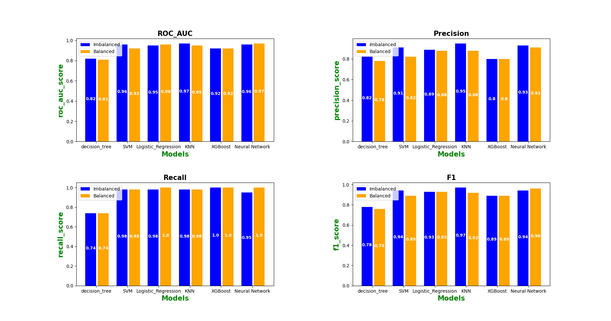

# Breast Cancer diagnosis

In this project, we aim to classify two types of breast tumors including:
#### Bengin
####  Malignant

### 
Futhermore, the result of the project is comparing the evelaution measures in a few tpyes of algorthms which are trained on both **Imbalanced** and **Balanced** dataset. The list of algorithms is as follows:

- SVM
- Logistic regreesion
- KNN
- Decision Tree
- XGBoost
- Neural Network

# Result
**Imbalanced dataset** : KNN model outperformed it's counterparts in ROC_AUC, Precision, and F1, but XGBoost model excelled compared to the others in Recall

**Balanced dataset** : Neural Network model outperformed it's counterparts in ROC_AUC, Precision, and F1, but Neural Network and XGBoost model were euqual in Recall

In conlusion, balancing has a positive effect on all the models in Recall measure.



## Run The Project

To run the project, run the following command

```bash
  pip install -r requirements.txt
```
then
```bash
  python app.py
```


