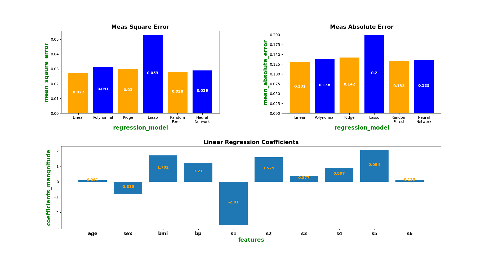

# Predicting Diabetes Progression


The result of the project is comparing the evelaution measures including **Mean Sqaured Error** and **Mean Absolute Error** in different algorthms. The list of algorithms is as follows:

- Linear regression 
- Polynomial regreesion
- Ridge regression
- Lasso regression
- Random Forest regreesion
- Neural Network regreesion

# Result
**Linear regression** model outperformed it's counterparts in MSE and MAE. Also, feature **s1** has the most significant effect.





## Run The Project

To run the project, run the following command

```bash
  pip install -r requirements.txt
```
then
```bash
  python app.py
```


