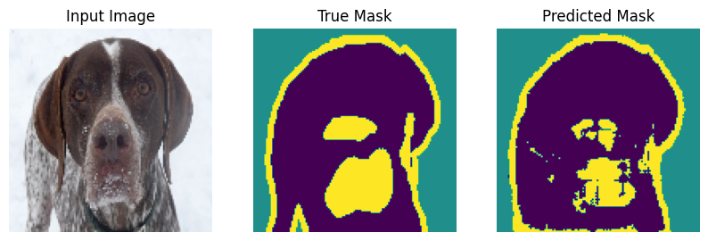
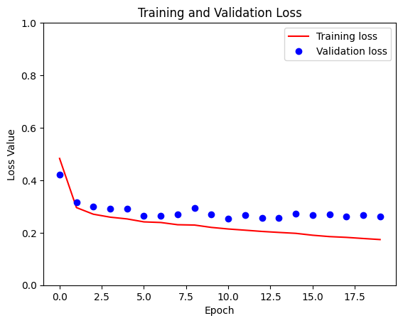
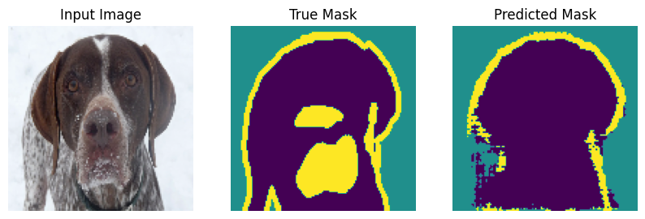
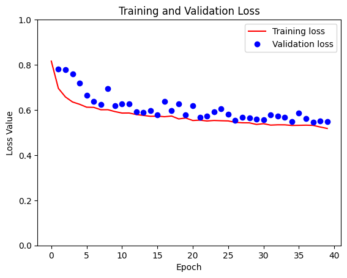

# Image segmentation
The project intends to construct a **U-net** model which includes **Encoder** and **Decoder**. The Encoder utilizes **MobileNetV2** as a pre-trained model to downsample and the Decoder applies **pix2pix** to upsample. In addition, the **ResNet50** is used as a pre-trained model in Decoder.

## Resource
I have applied the Image Segmentation project from the **Tensorflow** documentation.  
[Resource](https://www.tensorflow.org/tutorials/images/segmentation)

## Results
<table>
<tr>
<h3>MobileNetV2</h3>
<td></td>
<td></td> 
</tr>
<tr>
<h3>ResNet50</h3>
<td></td> 
<td></td> 
</tr>
</table>

